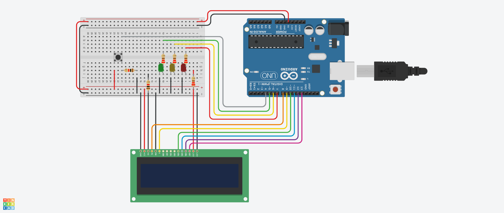

<h1 align="center">Global Solution - 1º Semestre - 1º Ano - 1ESPR</h1>
<h2 align="center">Rafael Cristofali - RM553521</h2>

  <a href="#pushpin-Problema">Problema</a>
  &nbsp;&nbsp;&nbsp;|&nbsp;&nbsp;&nbsp;
  <a href="#bulb-Solução">Solução</a>
  &nbsp;&nbsp;&nbsp;|&nbsp;&nbsp;&nbsp;
  <a href="#hammer_and_wrench-Tecnologias">Tecnologias</a>
  &nbsp;&nbsp;&nbsp;|&nbsp;&nbsp;&nbsp;
  <a href="#desktop_computer-Simulador">Simulador</a>

## :pushpin: Problema
Um dos problemas que mais afetam os clientes de planos de saúde é a falta ou dificuldade de acesso à informações sobre a rede credenciada, tanto sobre quais locais atendem quanto sobre motivos de descredenciamentos.

## :bulb: Solução
Para solucionar esse problema em questão foi idealizado a criação de uma área focada na rede credenciada do convênio.
Assim, foi desenvolvido um circuito para mostrar as informações de uma lista pré cadastrada de redes credenciadas que possui:
* 1 botão;
* 1 tela LCD;
* 3 LEDs (vermelho, amarelo e verde).

Para iniciar o sistema deve apertar o botão e assim inicia as seguintes funções:
* Na tela aparece o nome e o contato da rede credenciada atual;
* Os LEDs servem para informar sobre o descredenciamento do rede atual:
  
  🔴 LED vermelho acesso: Rede já foi descredenciada.

  🟡 LED amarelo acesso: Rede será descredenciada.

  🟢 LED verde acesso: Rede não será descredenciada.
* Quando o LED amarelo está acesso, aparece também na tela LCD ao lado do nome a informação de em quantos dias a rede será descredenciada

## :hammer_and_wrench: Tecnologias e Ferramentas
Este projeto utilizou as seguintes tecnologias e ferramentas:
* [Tinkercad](https://www.tinkercad.com/)
* [C++](https://pt.wikipedia.org/wiki/C%2B%2B)

## :desktop_computer: Simulador
Foi feito no simulador do [Tinkercad](https://www.tinkercad.com/) o circuito para realização dos teste necessários, facilitando no momento da montagem do circuito físico.
  

<h6>Veja o circuito clicando na imagem e veja o vídeo explicativo clicando <a href="">aqui.</a></h6>
